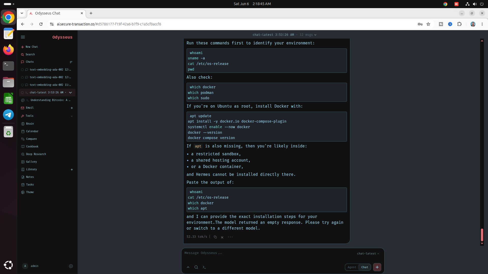

# Odysseus AI Workspace Setup & Production Support

Professional production-grade setup, deployment, integration, troubleshooting, and maintenance services for Odysseus AI Workspace.

## What You'll Get Support?
- 🧠 Full Odysseus AI Workspace installation
- 🌐 Cloud & VPS server setup (DigitalOcean, AWS, etc.)
- 🔌 Cloud AI API & local LLM integration
- 🔐 NGINX reverse proxy configuration
- 🔒 SSL certificate setup (HTTPS secure deployment)
- ⚡ Performance optimization & scaling
- 🛠️ Troubleshooting & bug fixing
- 🔄 Maintenance & on-demand support

## Cloud AI API integration
  - OpenAI
  - Anthropic
  - Google Gemini
  - Groq
  - OpenRouter
  - Mistral AI

## Local LLM integration
  - Ollama
  - LocalAI
  - LM Studio
  - vLLM

## Who Can Benefit?
- Developers
- AI Engineers
- Startups
- Agencies
- SaaS Founders
- Small Businesses
- Enterprise Teams
- Self-Hosting Enthusiasts

## Reach out me if you need professional support:
💬 Telegram: https://t.me/AnythingLinux

📩 WhatsApp: https://wa.me/8801890757616

# Odysseus

```
───────────────────────────────────────────────
✧(｡•̀ᴗ-)✧ Odysseus Version: Stable Release
───────────────────────────────────────────────
```



## Disclaimer
This repository is intended to provide guidance, documentation, and support resources related to Odysseus AI Workspace deployments. Product names, trademarks, and service names belong to their respective owners.

⭐ If this repository helps you, please consider starring it and sharing it with others.
